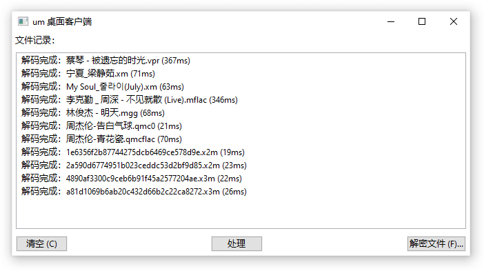

# Parakeet

[](https://github.com/parakeet-rs/parakeet-wx/actions/workflows/build-linux-x86_64.yml) [](https://github.com/parakeet-rs/parakeet-wx/actions/workflows/build-windows.yml)



一个用于解密下载的音乐文件工具的桌面客户端，使用 wxWidgets 作为基础 GUI 库开发。

该项目的灵感来自 [Unlock Music] 项目。该项目的目标是做一个低内存占用的桌面端通用解密工具。

项目百科：[支持的格式] | [便携版制作]

[支持的格式]: https://github.com/parakeet-rs/parakeet-wx/wiki/%E6%94%AF%E6%8C%81%E7%9A%84%E6%A0%BC%E5%BC%8F
[便携版制作]: https://github.com/parakeet-rs/parakeet-wx/wiki/%E4%BE%BF%E6%90%BA%E7%89%88%E5%88%B6%E4%BD%9C

## 下载

你可以在 [Latest Release] 下载最新的稳定版。

[latest release]: https://github.com/parakeet-rs/parakeet-wx/releases/latest

随代码提交自动构建的文件可以在 GitHub Action 产生的文件内找到。

| 名称                | 链接                                            |
| :------------------ | :---------------------------------------------- |
| Windows (MSVS 2022) | [`win32.zip`][dl_win32] [`win64.zip`][dl_win64] |
| Ubuntu 22.04        | [`linux-x86_64.zip`][dl_linux_x86_64]           |
| Linux (AppImage)    | [`AppImage-x86_64.zip`][dl_appimage_x86_64]     |

[dl_win32]: https://nightly.link/parakeet-rs/parakeet-wx/workflows/build-windows/main/win32.zip
[dl_win64]: https://nightly.link/parakeet-rs/parakeet-wx/workflows/build-windows/main/win64.zip
[dl_linux_x86_64]: https://nightly.link/parakeet-rs/parakeet-wx/workflows/build-linux-x86_64/main/linux-x86_64.zip
[dl_appimage_x86_64]: https://nightly.link/parakeet-rs/parakeet-wx/workflows/build-linux-x86_64/main/AppImage-x86_64.zip

### 关于密钥

🚨 你需要自行寻找密钥或加密参数并填入到软件。该项目**不会**提供解密所需的密钥。

请自行逆向内容提供商的应用程序，或寻求他人的帮助。

## 构建说明

### Windows 下构建

- 安装 CMake
- 安装 Visual Studio 2022
- 安装 Git-for-Windows (需要用到里面的 `bash` 环境)
- 安装 Python 3（修正 HiDPI 支持）

```sh
# 初始化 vcpkg、构建
bash scripts/build-configure-vcpkg.sh
bash scripts/build-prepare.sh

 # 调试版
cmake --preset win64-2022
cmake --build --preset win64-2022-debug

# 发布版
cmake --preset win64-2022
cmake --build --preset win64-2022-release
```

### Ubuntu 22.04 下构建

- 参考 `build-setup-ubuntu.sh` 的内容安装依赖的包，然后：

```sh
# 初始化 vcpkg、构建
bash scripts/build-configure-vcpkg.sh
bash scripts/build-prepare.sh

# 初始化 CMake 构建
cmake --preset ninja

# 编译/运行调试版
cmake --build --preset ninja-debug
./build/ninja/Debug/parakeet_wx

# 编译/运行发布版
cmake --build --preset ninja-release
./build/ninja/Release/parakeet_wx
```

## 相关项目

该项目多多少少参考了下述项目所实现的解密算法：

- [Unlock Music] - 项目灵感，很多算法都是从这里抠的。
- [nukemiko/libtakiyasha] - Python 的实现，支持多种加密类型。
- [davidxuang/MusicDecrypto] - C# 的实现，支持多种加密类型，使用 SIMD 加速。
- [zeroclear/unlock-mflac-20220931] - QMC2-EncV2 的解密实现。
- ncmdump & 衍生项目 - 原仓库已下线，参考了网易云音乐部分的解密代码。

[unlock music]: https://unlock-music.dev/
[nukemiko/libtakiyasha]: https://github.com/nukemiko/libtakiyasha
[davidxuang/musicdecrypto]: https://github.com/davidxuang/MusicDecrypto
[zeroclear/unlock-mflac-20220931]: https://github.com/zeroclear/unlock-mflac-20220931

## 声明

> 我（小鹦鹉软件作者）不支持、亦不提倡盗版。
> 我认为人们能够选择如何享用购买的内容。
> 小鹦鹉软件的使用者应保留解密后的副本做个人使用，而非进行二次分发。
> 其它条款请参考软件自带的[授权协议][parakeet_lic]。
>
> I (the Parakeet author) do not endorse nor encourage piracy.
> I believe that people should have a choice when consuming purchased content.
> Parakeet users should keep their decrypted copies for private use, not to re-distribute them.
> For other terms, checkout the [license][parakeet_lic].

[parakeet_lic]: https://github.com/parakeet-rs/parakeet-wx/blob/main/LICENSE
