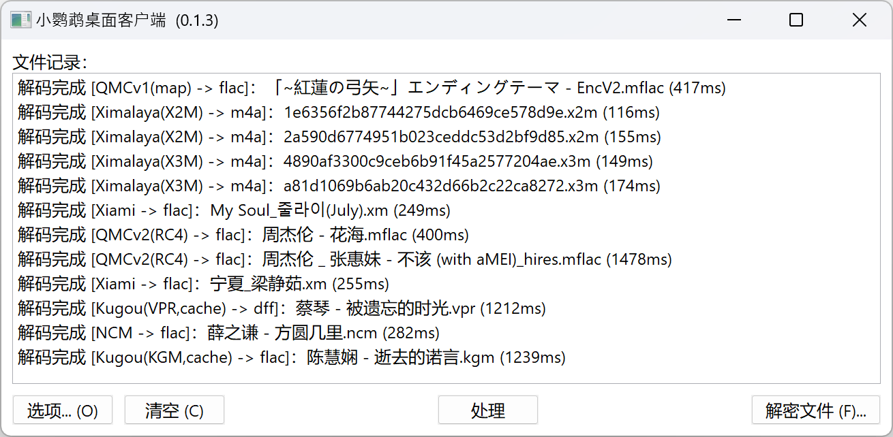

# Parakeet

[](https://github.com/jixunmoe/parakeet/actions/workflows/build-linux-x86_64.yml) [](https://github.com/jixunmoe/parakeet/actions/workflows/build-win64.yml)

对 unlock-music 的非官方实现，使用 wxWidgets 作为基础 GUI 库开发。



链接：[支持的格式一览][sup_format]

[sup_format]: https://github.com/jixunmoe/parakeet/wiki/%E6%94%AF%E6%8C%81%E7%9A%84%E6%A0%BC%E5%BC%8F

## 下载

自动构建的文件可以在 GitHub Action 产生的文件内找到。

|              名称               | 链接                                        |
| :-----------------------------: | :------------------------------------------ |
|     Windows x64 (MSVS 2019)     | [`win64.zip`][dl_win64]                     |
| Linux ( x86_64 / Ubuntu 20.04 ) | [`linux-x86_64.zip`][dl_linux_x86_64]       |
|   Linux ( x86_64 / AppImage )   | [`AppImage-x86_64.zip`][dl_appimage_x86_64] |

[dl_win64]: https://nightly.link/jixunmoe/parakeet/workflows/build-win64/main/win64.zip
[dl_linux_x86_64]: https://nightly.link/jixunmoe/parakeet/workflows/build-linux-x86_64/main/linux-x86_64.zip
[dl_appimage_x86_64]: https://nightly.link/jixunmoe/parakeet/workflows/build-linux-x86_64/main/AppImage-x86_64.zip

### 关于密钥

你需要自行寻找密钥或加密参数并填入到软件。该项目**不会**提供解密所需的密钥。

请自行逆向内容提供商的应用程序，或寻求他人的帮助。

## 构建说明

### Windows 下构建

- 安装 CMake
- 安装 Visual Studio 2019

```powershell
# 初始化 vcpkg
.\vcpkg\bootstrap-vcpkg.bat

 # 调试版
cmake --preset win64-2019-dbg
cmake --build --preset win64-2019-dbg

# 发布版
cmake --preset win64-2019-rel
cmake --build --preset win64-2019-rel
```

### Linux (Ubuntu 22.04) 下构建 (vcpkg)

- 安装工具链： `sudo apt-get install build-essential cmake ninja-build`
- 参考 `build-setup-ubuntu.sh` 的内容安装依赖的包。
- 执行 `bash ./prepare.linux.sh` 进行初始化。

本项目目前不再推荐脱离 vcpkg 进行编译。

#### Linux (Fedora 36)

- 安装工具链：

  ```sh
  sudo dnf install gcc cmake extra-cmake-modules \
                   ninja-build make \
                   perl-{FindBin,IPC-Cmd,File-Copy,Compare} \
                   {gtk3,wxGTK,libwebp,libzstd,jbigkit,systemd}-devel
  ```

## 相关内容与链接

### 由我开发或参与的项目

- [小鹦鹉桌面客户端 | Jixun 的项目集](https://jixun.moe/apps/parakeet/)
- [QMC v1 解密工具](/utils/qmc-v1-decode/)
  - GitHub: [C 实现](https://github.com/jixunmoe/qmc-decode)
- [QMC v2 解密工具](/utils/qmc-v2/)
  - GitHub: [C++ 实现](https://github.com/jixunmoe/qmc2) · [Rust 实现](https://github.com/jixunmoe/qmc2-rust)
- Joox 解密库 - JavaScript 实现 
- 酷狗 KGM/VPR 解密 - JavaScript 实现 

### 同类项目

该项目多多少少参考了下述项目所实现的解密算法：

- Unlock Music - [Web (TypeScript)](https://git.unlock-music.dev/um/web) · [Cli (Go)](https://github.com/unlock-music/cli)
-  - Python 的实现，支持多加密方案
-  - C# 的实现，支持多加密方案，使用 SIMD 加速。
- ncmdump & 衍生项目 - 原仓库已下线，参考了网易云音乐部分的解密代码。

### 特别致谢

该项目的开发使用了下述代码库与工具：

- vcpkg 依赖管理
  - boost 库及其依赖；
  - Crypto++ 提供标准加解密算法；
  - rapidjson 提供配置文件解析与序列化；
  - wxWidgets 提供界面库及其依赖；
- CMake 提供方便的跨平台编译方案
- VSCode 与相关扩展进行开发
