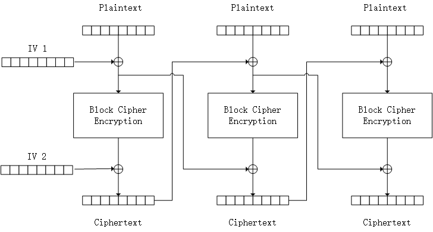

# Tencent's implementation of TEA

Implemented according to the spec described in
[iweizime/StepChanger:腾讯 TEA 加密算法][wiki_tc_tea]

[wiki_tc_tea]: https://github.com/iweizime/StepChanger/wiki/%E8%85%BE%E8%AE%AFTEA%E5%8A%A0%E5%AF%86%E7%AE%97%E6%B3%95

... where IV1 and IV2 are initialised to ZEROs.
